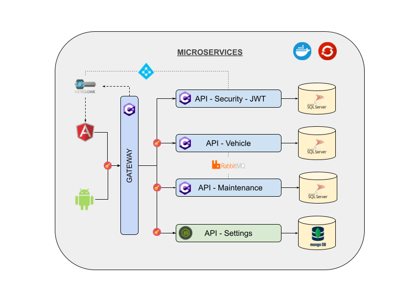
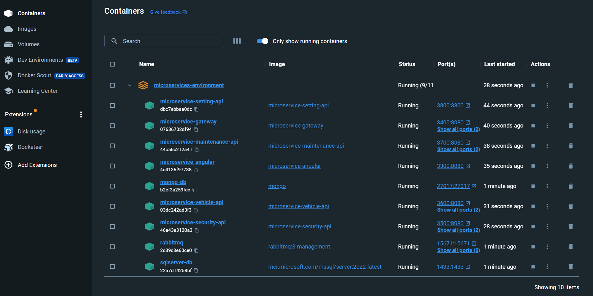
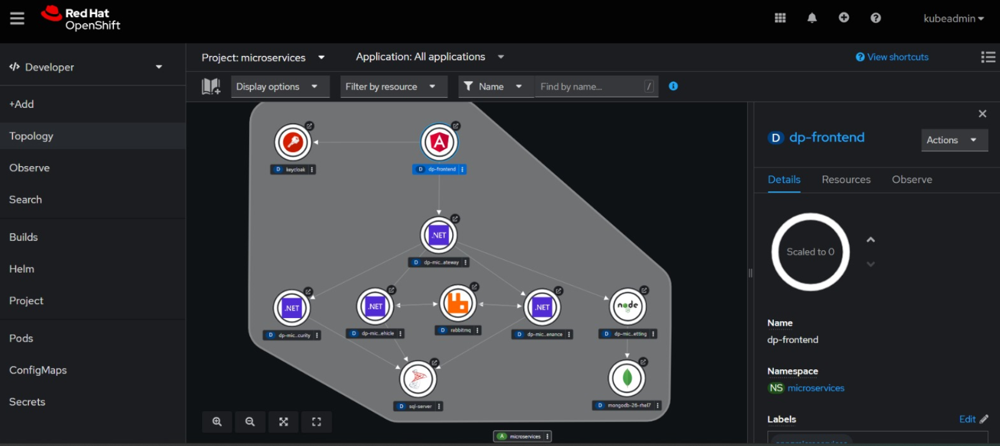

# Architecture templates
Solutions example to improve and practice clean code and clean architecture.

## Technologies
Architectures on this is projects:
* Backend:
    * .NET Layer Architecture with JWT
    * .NET and NodeJS Microservices with JWT and/or keycloak
* Frontend:
    * Angular with Keycloak
    * Angular using SSR builder
    * .NET MVC with Keycloak

## Microservices with Docker

## Microservices with Openshift

